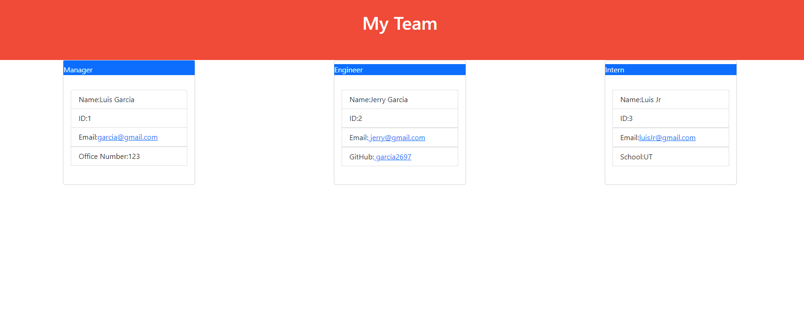

# Employee Testing

## Table of Contents

- [Description](#Description)
- [Installation](#Installation)
- [Usage](#Usage)
- [Testing](#Testing)
- [Deployed](#Deployed)
- [Author](#author)
- [Screenshot](#Screenshot)

### Description
Creates a quick employee database. It is currently limited to only 3 people since the main use of the app was to show that proficiency  in unit testing. 

User Story
AS A manager
I WANT to generate a webpage that displays my team's basic info
SO THAT I have quick access to their emails and GitHub profiles

### Installation
To install this app. CLone the repository, run npm install wihtin the root directory, this will allow all necessary dependencies from the package.json file. Afterwards type in npm start. 

### Usage
To use this app. Follow the installation instructions. Start the app using node index.js. To test your app type in npm test.

### Testing
Testing was done by using JEST

### Deployed
GitHub Repository: https://github.com/garcia2697/employee-testing
Walk Through Video:https://drive.google.com/file/d/1nFnDQexKtTAukXi9hze9IJ-BFwXeAs64/view

### Author
Luis Garcia
GitHub: https://github.com/garcia2697

### Screenshot
